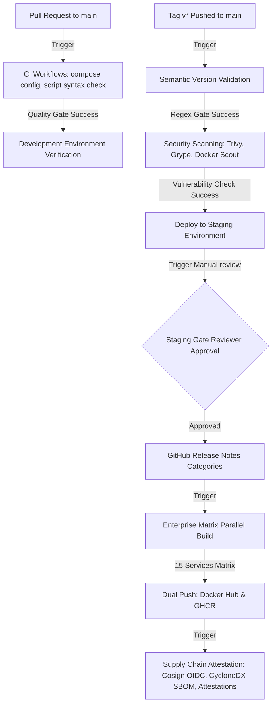

# OWASP AttackForge - DevSecOps CI/CD Platform Documentation

This document describes the platform architecture, versioning guidelines, registry publication structure, security auditing, and release promotion logic for **OWASP AttackForge**.

---

## 🏛️ 1. Platform Architecture

The repository employs a multi-tiered, event-driven CI/CD architecture powered by GitHub Actions. Every release candidate undergoes strict automated checks before being promoted to Staging, and finally to Production upon manual manager approval.

---

## 📄 2. CI/CD Overview

The pipeline split logic consists of 6 workflows:
1.  **Tag Validation (`semantic-version-validation.yml`)**: Validates version strings prior to build operations.
2.  **Lint & Syntax checks (`ci.yml`)**: Validates compose parameters and script syntax.
3.  **Vulnerability scans (`security.yml`)**: Scans code directories and base images.
4.  **Changelog Builder (`changelog.yml`)**: Compiles incremental git commit records using `git-cliff`.
5.  **Release Engine (`release.yml`)**: Coordinated promotion workflow driving environment checks and releases.
6.  **Supply Chain Attestation (`supply-chain-attest.yml`)**: Verifies container build legitimacy.

---

## 🚀 3. Release Process

The promotion path to Production is gated across three environments:
1.  **Development**: Checked on pull requests. Any code change must build and configure successfully.
2.  **Staging**: Activated upon a SemVer tag push. Deploys release candidates and runs integration smoke tests.
3.  **Production**: Gated by manual GitHub Environment protection rules. Releases are blocked until an authorized reviewer approves. Pushing releases tags production containers and generates the final release pages.

---

## 🏷️ 4. Versioning Policy

We enforce strict Semantic Versioning (**SemVer**) tags matching the regex:
`^v[0-9]+\.[0-9]+\.[0-9]+$`

Accepted formats:
*   `v1.0.0`
*   `v1.12.5`
*   `v2.4.18`

Rejected formats (fails the validation gate):
*   `1.0`
*   `version1`
*   `release-1.0`

Versioning is computed based on **Conventional Commits**:
*   `feat: ...` -> bumps minor version (e.g. `v1.0.0` -> `v1.1.0`)
*   `fix: ...` -> bumps patch version (e.g. `v1.0.0` -> `v1.0.1`)
*   `BREAKING CHANGE: ...` -> bumps major version (e.g. `v1.0.0` -> `v2.0.0`)

---

## 🐳 5. Registry Strategy

Built containers are dual-published in parallel to guarantee high availability and flexible pull contexts:

*   **Primary Registry**: Docker Hub (`docker.io`)
*   **Secondary Registry**: GitHub Container Registry (`ghcr.io`)

### Naming Conventions
*   Docker Hub: `docker.io/<org>/attackforge-<service>:<tag>`
*   GHCR: `ghcr.io/<org>/attackforge-<service>:<tag>`

### Required Tags
For every release tag (e.g., `v1.2.3`), the publisher generates:
*   `latest` (Latest stable release)
*   `1` (Major tag fallback)
*   `1.2` (Minor tag fallback)
*   `1.2.3` (Patch version tag)
*   `sha-<commit-short-sha>` (Direct commit audit trace)

---

## 🛡️ 6. Security Policy

*   **Scout, Trivy, and Grype Scanning**: Scans are performed on base images, source files, and dependencies weekly.
*   **Vulnerability Severity Thresholds**:
    *   **CRITICAL**: Build failure (fails build pipelines immediately).
    *   **HIGH**: Warning output generated on the Actions dashboard.
*   **Cosign Signing**: Keyless OIDC signatures are applied to all GHCR container manifests using short-lived GitHub trust tokens.
*   **CycloneDX SBOMs**: Generated for every image and stored as build logs and attested metadata.

---

## 🤝 7. Contribution Guide

1.  Create a branch from `main`.
2.  Write commit messages following **Conventional Commits** (e.g. `feat: ...`, `fix: ...`).
3.  Open a Pull Request to `main`. This triggers linting, compose file syntax checks, and secret auditing.
4.  Once merged, tags will be auto-incremented by the release scheduler.
5.  All releases require manual approval from repository maintainers before publishing to production registries.
